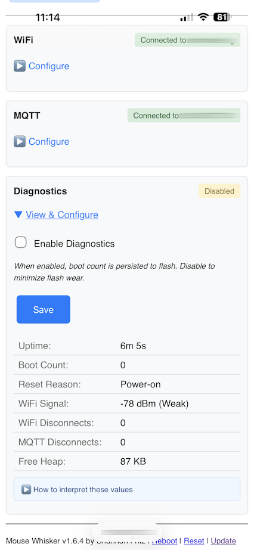
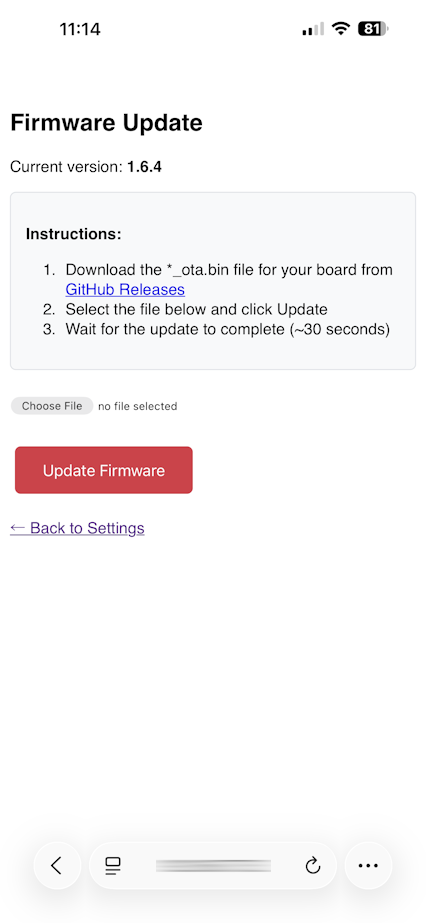
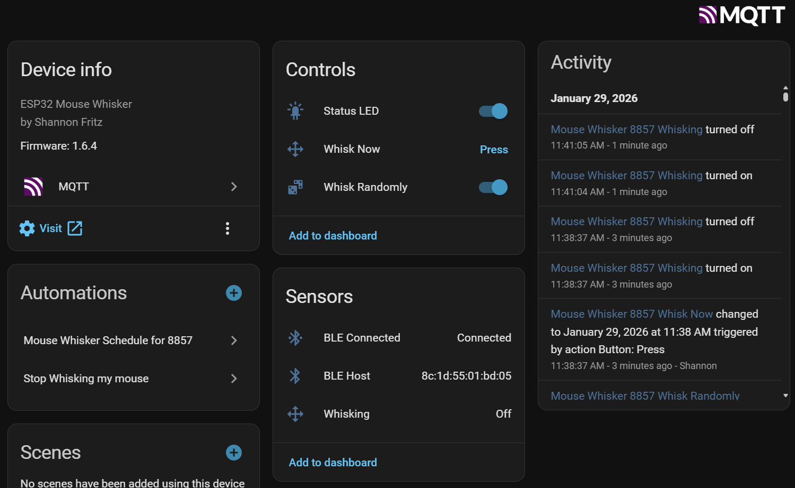
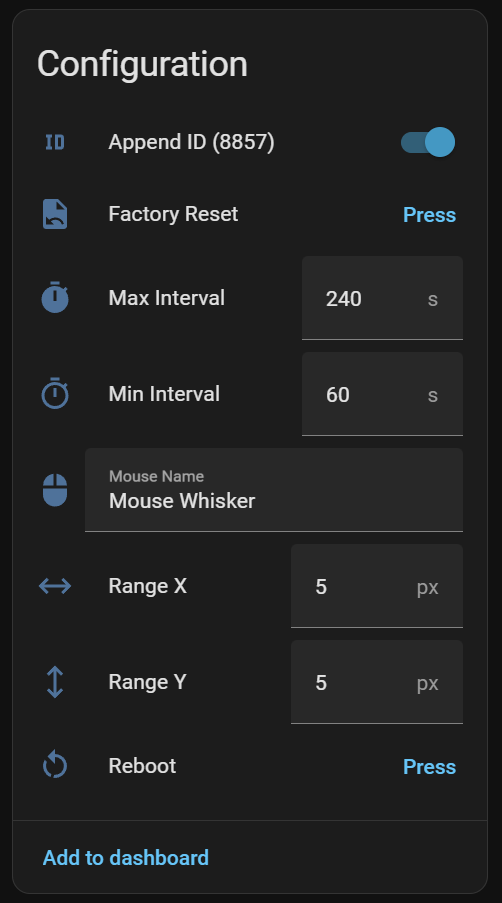
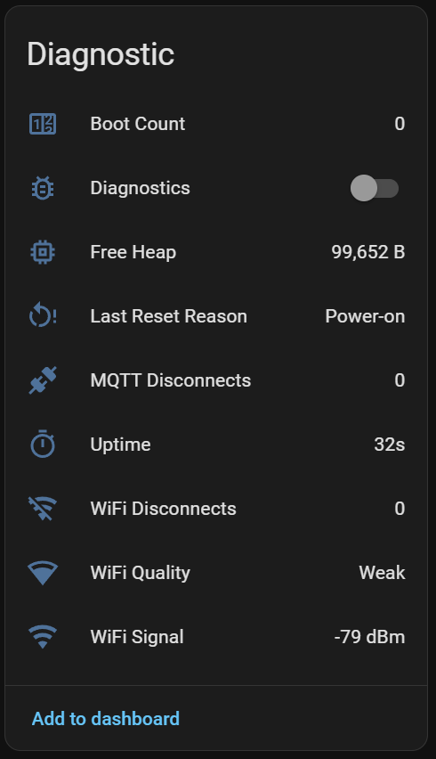

# 🖱️ ESP32 Mouse Whisker

**A tiny Bluetooth and USB mouse jiggler that whisks your cursor to keep your computer awake — with optional WebUI and Home Assistant controls.**

Perfect for preventing sleep/lock screens during presentations, downloads, or remote sessions. Works standalone or integrates with your smart home.

 

---

## ✨ Features

- 🔵 **Bluetooth LE Mouse** — Pairs like any wireless mouse, no dongle needed
- 🔌 **USB HID Support** — Optional wired mode for S3/S2 boards
- 🎲 **Randomized Movement** — Subtle, organic patterns that won't trigger detection
- ⚙️ **Flexible Configuration** — Set WiFi/MQTT via WebUI or compile-time constants
- 🌐 **Local WebUI** — Configure everything from your browser, no coding required
- 📶 **AP Mode & Captive Portal** — Creates its own hotspot when WiFi unavailable; auto-redirects to setup
- 🏠 **Home Assistant Integration** — MQTT auto-discovery, full control from your dashboard
- 💾 **Persistent Settings** — Remembers your config after power loss
- 💡 **LED Feedback** — Breathing pulse shows status; event blinks for connections

### WebUI Screenshots

<p align="center">
  <a href="images/mouse-whisker-webui-main.png"></a>
  <a href="images/mouse-whisker-webui-settings.png"></a>
  <a href="images/mouse-whisker-webui-update.png"></a>
</p>

---

## 🚀 Quick Start

Just pick the device you want to run it on, then you can flash it with the precompiled binaries from Releases, or compile and upload the Sketch yourself.

### 1. Get the Hardware (~$3-5)

| Board | BLE | USB HID | WiFi | Notes |
|-------|:---:|:-------:|:----:|-------|
| **[ESP32-C3 Super Mini](https://www.espboards.dev/esp32/esp32-c3-super-mini/)** | ✅ | ❌ | ✅ | Small board but wifi can be weak |
| **[ESP32-S3 Super Mini](https://www.espboards.dev/esp32/esp32-s3-super-mini/)** | ✅ | ✅ | ✅ | Full features, RGB LED |
| **[ESP32-S2 Mini](https://www.espboards.dev/esp32/lolin-s2-mini/)** | ❌ | ✅ | ✅ | USB only, no Bluetooth |
| **[ESP32 D1 Mini](https://www.espboards.dev/esp32/d1-mini32/)** | ✅ | ❌ | ✅ | Classic ESP32, *Recommended* |
| **[ESP32 NodeMCU](https://www.espboards.dev/esp32/nodemcu-32s/)** | ✅ | ❌ | ✅ | Classic ESP32, LED pin may vary |

### 2. Flash the Firmware

Either use a precompiled binary for your board or compile it yourself with the Arduino IDE.  See [guidance below](#flashing-firmware).

### 3. Connect it!

**Option A: Use immediately with Bluetooth**
- Pair **"Mouse Whisker XXXX"** via Bluetooth on your computer
- Works right away with default settings — no configuration needed!

**Option B: Configure via WebUI**
1. Connect your phone/laptop to the **"Mouse Whisker XXXX"** WiFi hotspot
2. A captive portal should open automatically (or browse to `192.168.4.1`)
3. Enter your WiFi and MQTT credentials, save, and the device will reboot
4. Device auto-appears in Home Assistant once connected

---

<a id="flashing-firmware"></a>

## ⚡ Flashing Pre-compiled Firmware

Don't want to set up Arduino IDE? Flash a pre-built binary directly from your browser!  You can then pair it via Bluetooth and use it with defaults or connect to the **"Mouse Whisker XXXX"** WiFi hotspot to configure the device from its own WebUI.

### Requirements
- **Chrome, Edge, or Opera** browser (WebSerial support required)
- USB cable connected to your ESP32 board

> **💡 Tip:** If connection fails, hold the **BOOT** button on your board while clicking Connect, then release after connected.

<details open>
<summary><strong>Option A: ESPHome Web (Easiest)</strong></summary>

1. Download the `*_full.bin` file for your board from [Releases](../../releases)
2. Go to **[web.esphome.io](https://web.esphome.io/)**
3. Click **Connect** and select your board's serial port
4. Click **Install** → **Choose file** and select the downloaded `.bin`
5. Wait for flashing to complete, then watch the LED for status
6. Optionally click **Logs** to view the log messages via serial output

</details>

<details>
<summary><strong>Option B: Adafruit WebSerial ESPTool</strong></summary>

1. Download the `*_full.bin` file for your board from [Releases](../../releases)
2. Go to **[Adafruit WebSerial ESPTool](https://adafruit.github.io/Adafruit_WebSerial_ESPTool/)**
3. Click **Connect** and select your board's serial port
4. Set the address to **`0x0`**
5. Click **Choose a file...** and select the downloaded `.bin`
6. Click **Program**, then watch the LED for status

</details>

### Available Firmware Builds

All precompiled binaries are configured for Access Point WebUI setup where it can be configured to connect to your Wifi and MQTT Brokers (Home Assistant).  If the board supports it, Bluetooth (BLE) and or USB is also enabled as well as log output via Serial.

**Two versions of each binary are provided:**
- `*_full.bin` — Complete flash image (bootloader + partition table + app) for initial USB flashing
- `*_ota.bin` — App-only image for OTA firmware updates via WebUI

| File | Board | Features |
|------|-------|----------|
| `mouse-whisker_vX.X.X_esp32c3_ble_full.bin` | ESP32-C3 Super Mini | AP + WiFi + MQTT + BLE |
| `mouse-whisker_vX.X.X_esp32s3_ble_usb_full.bin` | ESP32-S3 Super Mini | AP + WiFi + MQTT + BLE + USB |
| `mouse-whisker_vX.X.X_esp32s3_ble_full.bin` | ESP32-S3 Super Mini | AP + WiFi + MQTT + BLE (no USB) |
| `mouse-whisker_vX.X.X_esp32s2_usb_full.bin` | ESP32-S2 Mini | AP + WiFi + MQTT + USB |
| `mouse-whisker_vX.X.X_esp32_ble_full.bin` | ESP32 D1 Mini / NodeMCU | AP + WiFi + MQTT + BLE |

## ⚡ Compiling your own Firmware

If you want to make changes or just hardcode some of the settings, you can compile the sketch yourself and upload it to your ESP device.

<details>
<summary><strong>⚙️ Compile from the Sketch...</strong></summary>

### 1. Install Arduino IDE
- Download [Arduino IDE 2.x](https://www.arduino.cc/en/software)
- Add ESP32 board support: **File → Preferences → Additional Board URLs:**
  ```
  https://espressif.github.io/arduino-esp32/package_esp32_index.json
  ```
- **Tools → Board → Boards Manager** → Install "esp32" by Espressif

### 2. Install Libraries
**Sketch → Include Library → Manage Libraries:**
- **NimBLE-Arduino** by h2zero *(required for BLE)* — tested with 2.3.7
- **PubSubClient** by Nick O'Leary *(only if using MQTT)* — tested with 2.8
- **Adafruit NeoPixel** by Adafruit *(only for S3/S2 boards with RGB LED)* — tested with 1.15.2

### 3. Configure & Upload
1. Open `mouse-whisker.ino`
2. Optionally edit WiFi/MQTT credentials (or leave as `SET_IN_WEBUI` to configure later via AP mode)
3. Select board: **Tools → Board → esp32 →** then pick your board type (see [Hardware Details](#hardware-details) for full settings)
4. Upload!

</details>

---

## 🏠 Home Assistant

When WiFi/MQTT is enabled, the device **auto-discovers** in Home Assistant. No YAML needed!

<p align="center">
  <a href="images/mouse-whisker-ha-main.png"></a>
</p>

**Controls:**
- Status LED (on/off switch)
- Whisk Now (button)
- Whisk Randomly (on/off switch)

**Sensors:**
- BLE Connected (connectivity status)
- BLE Host (address of connected device)
- USB Mounted (S3/S2 only)
- Whisking (on briefly during mouse movement)

<p align="center">
  <a href="images/mouse-whisker-ha-config.png"></a>
  <a href="images/mouse-whisker-ha-diag.png"></a>
</p>

**Configuration:**
- Append ID (toggle unique ID suffix)
- Min/Max Interval (1-600 seconds)
- Range X/Y (0-127 pixels)
- Mouse Name (text input)
- Reboot / Factory Reset (buttons)

**Diagnostics** (when enabled):
- Boot Count (persisted across reboots)
- Diagnostics (on/off switch - enables diagnostic sensors)
- Free Heap (bytes, with min_free_heap in attributes)
- Last Reset Reason (power-on, watchdog, crash, etc.)
- MQTT Disconnects (this session)
- Uptime (human-readable, with seconds in attributes)
- WiFi Disconnects (this session)
- WiFi Quality (Excellent/Good/Weak/Poor)
- WiFi Signal Strength (dBm)

---

<details>
<summary><strong>🔧 Compile Time Options</strong></summary>

### Feature Flags

Edit these at the top of `mouse-whisker.ino`:

```cpp
#define ENABLE_WIFI true   // WiFi connectivity
#define ENABLE_MQTT true   // MQTT + Home Assistant (requires WiFi)
#define ENABLE_WEBUI true  // Local WebUI for configuration
#define ENABLE_BLE true    // Bluetooth LE mouse
#define ENABLE_USB false   // USB HID mouse (S3/S2 only)
#define ENABLE_LED true    // Status LED
```

### Network Credentials

You have two options for configuring WiFi and MQTT:

**Option 1: Configure via WebUI (recommended)**  
Leave the defaults as `SET_IN_WEBUI` and configure credentials through the captive portal when the device boots in AP mode.

**Option 2: Hardcode at compile time**  
Replace the `SET_IN_WEBUI` values in the sketch before uploading:

```cpp
const char* DEFAULT_WIFI_SSID = "YourWiFi";
const char* DEFAULT_WIFI_PASS = "YourPassword";
const char* DEFAULT_MQTT_SERVER = "192.168.1.100";
const uint16_t DEFAULT_MQTT_PORT = 1883;
const char* DEFAULT_MQTT_USER = "mqtt_user";
const char* DEFAULT_MQTT_PASS = "mqtt_pass";
```

### Default Behavior

- **Movement range:** ±5 pixels (barely visible)
- **Interval:** Random 60-240 seconds (1-4 minutes)
- **Device name:** "Mouse Whisker" + unique ID
- **Starts whisking:** Immediately on power-up

### Mouse Name Limits
- Max 29 characters (BLE advertising limit; USB uses the same name)
- With ID suffix enabled: 24 chars for name + 5 for " XXXX"

</details>

---

<details>
<summary><strong>📡 MQTT Reference</strong></summary>

All topics use the pattern: `mousewhisker/<uniqueId>/...`

The `<uniqueId>` is a 4-character hex code derived from the chip's factory-programmed base MAC address (e.g., `8857`).

### State Topics (read)

| Topic | Description |
|-------|-------------|
| `.../state` | `running` or `stopped` |
| `.../config` | JSON with all current settings |
| `.../availability` | `online` or `offline` |
| `.../event` | JSON event notifications (e.g., `{"event": "whisked"}`) |
| `.../whisking` | `ON` briefly during movement |
| `.../ble_connected` | `ON` or `OFF` |
| `.../ble_host` | Address of connected BLE host (or `none`) |
| `.../usb_mounted` | `ON` or `OFF` (S3/S2 only) |
| `.../wifi_rssi` | WiFi signal strength in dBm |
| `.../diagnostics` | JSON with diagnostic data (when enabled) |

### Command Topics (write)

| Topic | Payload |
|-------|---------|
| `.../set/enable` | `1`/`0` or `on`/`off` |
| `.../set/xrange` | `0`-`127` |
| `.../set/yrange` | `0`-`127` |
| `.../set/minmove` | `1`-`600` (seconds) |
| `.../set/maxmove` | `1`-`600` (seconds) |
| `.../set/name` | USB/BLE device name (max 24 or 29 chars) |
| `.../set/appendid` | `1`/`0` — toggle unique ID suffix |
| `.../set/led` | `1`/`0` |
| `.../set/diagnostics` | `1`/`0` — enable/disable diagnostic sensors |
| `.../cmd/whisk` | Any payload — trigger immediate whisk |
| `.../cmd/reboot` | Any payload |
| `.../cmd/factory_reset` | Any payload |

</details>

---

<details>
<summary><strong>💡 LED Status Codes</strong></summary>

### Normal Operation
- **Breathing pulse** — Device is running normally

### Event Blinks

| Event | Pattern | Meaning |
|-------|---------|---------|
| Mouse whisk | 1 quick flash | "I moved the mouse" |
| BLE connected | 2 slow pulses | "A device paired with me" |
| WiFi connected | 1 long pulse | "I'm on the network" |
| AP mode started | 5 blinks | "I'm in setup mode" |
| MQTT connected | 3 rapid taps | "Home Assistant can see me" |
| BLE advertising started | 3 rapid taps | "I'm ready to pair" |
| Setup complete | 5 rapid flutters | "I'm ready to go!" |

### LED Types by Board

| Board | LED Type | GPIO |
|-------|----------|------|
| ESP32-C3 Super Mini | Single (blue) | GPIO8 |
| ESP32-S3 Super Mini | RGB (WS2812) | GPIO48 |
| ESP32-S2 Mini | RGB (WS2812) | GPIO18 |
| ESP32 D1 Mini | Single | GPIO2 |

</details>

---

<details>
<summary><strong>🛠️ Troubleshooting</strong></summary>

### Upload fails / timeout
- Hold **BOOT** button while plugging in USB, then upload
- Try lower upload speed (460800 or 115200)

### BLE not connecting
- Forget the device in your OS Bluetooth settings, then re-pair
- Check that `ENABLE_BLE true` is set

### Mouse movement not detected
- Ensure BLE is paired and connected (check LED blinks)
- Try increasing movement range (X/Y) in settings

### Home Assistant not discovering
- Verify MQTT broker is running and credentials are correct
- Check **Settings → Devices → MQTT** for the device
- Device appears as "Mouse Whisker XXXX"

### WiFi not connecting
- Double-check SSID and password (case-sensitive)
- Ensure 2.4GHz network (ESP32 doesn't support 5GHz)

### No serial output / Serial Monitor blank
- **ESP32-C3/S3 Super Mini, ESP32-S2 Mini:** Set **USB CDC On Boot: Enabled** in Arduino IDE board settings, then re-upload
- **ESP32 D1 Mini / NodeMCU:** Should work automatically (external USB-serial chip)

### Factory Reset
- Via Home Assistant: Press "Factory Reset" button
- Via MQTT: Publish to `.../cmd/factory_reset`
- This clears all saved settings and reboots with defaults

</details>

---

<details id="hardware-details">
<summary><strong>🔩 Hardware Details</strong></summary>

### Arduino IDE Board Settings

**For ESP32-C3:**
- **Supports:** BLE HID, WiFi, WebUI, MQTT *(no USB HID)*
- **LED:** Single (blue) on GPIO8
- Board type in Arduino IDE: "ESP32C3 Dev Module"
- USB CDC On Boot: Enabled *(required for serial output)*
- Flash Size: 4MB
- Partition Scheme: Minimal SPIFFS (1.9MB APP with OTA/190KB SPIFFS) *(required for OTA updates)*

**For ESP32-S3:**
- **Supports:** BLE HID, USB HID, WiFi, WebUI, MQTT *(full feature support)*
- **LED:** RGB (WS2812) on GPIO48
- Board type in Arduino IDE: "ESP32S3 Dev Module"
- USB CDC On Boot: Enabled *(required for serial output)*
- USB Mode: Hardware CDC and JTAG
- Partition Scheme: Minimal SPIFFS (1.9MB APP with OTA/190KB SPIFFS) *(required for OTA updates)*

**For ESP32-S2:**
- **Supports:** USB HID, WiFi, WebUI, MQTT *(no Bluetooth)*
- **LED:** RGB (WS2812) on GPIO18
- Board type in Arduino IDE: "ESP32S2 Dev Module"
- USB CDC On Boot: Enabled *(required for serial output)*
- Partition Scheme: Minimal SPIFFS (1.9MB APP with OTA/190KB SPIFFS) *(required for OTA updates)*

**For ESP32 D1 Mini:**
- **Supports:** BLE HID, WiFi, WebUI, MQTT *(no USB HID)*
- **LED:** Single on GPIO2
- Board type in Arduino IDE: "ESP32 Dev Module"
- Serial works over USB (external USB-serial chip)
- Partition Scheme: Minimal SPIFFS (1.9MB APP with OTA/190KB SPIFFS) *(required for OTA updates)*

**For ESP32 NodeMCU:**
- **Supports:** BLE HID, WiFi, WebUI, MQTT *(no USB HID)*
- **LED:** Single on GPIO2 *(varies by board)*
- Board type in Arduino IDE: "ESP32 Dev Module" or "NodeMCU-32S"
- Serial works over USB (external USB-serial chip)
- Partition Scheme: Minimal SPIFFS (1.9MB APP with OTA/190KB SPIFFS) *(required for OTA updates)*

</details>

---

## 📜 Version History

### v1.6.4
- 🐛 **WiFi Reconnect Fix** — Fixed "sta is connecting, cannot set config" error when reconnecting after disconnect
- 🐛 **Hidden SSID Retry Count** — Fixed log showing wrong attempt count when hidden mode triggered
- 🐛 **WiFi Quality Consistency** — Aligned signal quality thresholds across WebUI, MQTT, and serial output
- ✨ **WiFi Signal Quality in WebUI** — Diagnostics now shows signal strength with quality rating (Excellent/Good/Weak/Poor)
- 🎨 **Serial Output Formatting** — "Connecting to WiFi" now prints before dots for better feedback in web-based serial viewers

### v1.6.3
- ✨ **Hidden SSID Auto-Detection** — Automatically detects hidden networks and uses extended timeouts; no manual checkbox needed

### v1.6.2
- ✨ **Factory Reset via WebUI** — Reset link in footer with confirmation page to erase all settings
- 🐛 **Captive Portal Polish** — Consistent landing page styling across all iOS CNA interactions

### v1.6.1
- ✨ **WiFi Reconnect Logic** — Retries every 60s for 10 min after disconnect, then falls back to AP mode
- ✨ **Smarter AP Mode Retry** — Attempts WiFi every 3 min (was 15), only when no clients connected
- 🎨 **WebUI Styling** — Consistent font sizes for buttons and inputs, improved readability
- 🎨 **WebUI Layout** — WiFi/MQTT/Diagnostics sections now use clean card layout
- 🧹 **Firmware Link** — Moved to footer for cleaner interface

### v1.6.0
- ✨ **OTA Firmware Updates** — Upload new firmware via WebUI without USB cable
- 📦 **Partition Scheme** — Changed to min_spiffs for more code space (~1.9MB vs 1.2MB)
- 🐛 **iOS Captive Portal Fix** — Proper two-phase response for reliable CNA popup and blue checkmark
- ✨ **Improved Landing Page** — Styled card UI with "Open Setup" button in captive portal
- 🔍 **CNA Compatibility** — Uses `<TITLE>Success</TITLE>` pattern that iOS requires for checkmark
- 🧹 **Code Cleanup** — Removed unused portal-done handler, simplified captive portal logic

### v1.5.1
- ✨ **Diagnostic Sensors** — Uptime, boot count, reset reason, WiFi/MQTT disconnect counts, free heap memory
- ✨ **Diagnostics Toggle** — Enable/disable from Home Assistant to minimize flash wear and MQTT traffic
- ✨ **WebUI Diagnostics** — View and configure diagnostics directly from the web interface
- ✨ **Diagnostics Help** — Collapsible guide explaining how to interpret each metric
- 🛡️ **Flash Protection** — Boot count only written when diagnostics enabled (off by default)
- 🔍 **Troubleshooting Aid** — Helps determine if connectivity issues are WiFi signal or device crashes

### v1.5.0 — The Whisker Release
- 🎉 **Rebranded** from "Mouse Jiggler" to "Mouse Whisker"
- 🔄 **MQTT Topics** — Changed prefix from `mousejiggler/` to `mousewhisker/`
- 🔄 **HA Entities** — Changed prefix from `mjiggler_` to `mousewhisker_`
- 🔄 **Terminology** — All "jiggle" references changed to "whisk"
- ⚠️ **Breaking** — Settings reset required (new preferences namespace)

### v1.4.0
- ✨ **Captive Portal** — Connect and configure via phone/laptop when device is in AP mode
- ✨ **iOS Compatibility** — Proper Captive Network Assistant support with Success page handoff to Safari
- ✨ **Hidden SSID Support** — Connect to non-broadcast WiFi networks
- ✨ **WiFi Retry Logic** — 3 attempts on startup, periodic retry every 15 minutes from AP mode
- ✨ **Network Diagnostics** — Scan available networks and detailed status logging for troubleshooting
- ✨ **Password Reveal** — Toggle visibility on password fields in WebUI
- ✨ **Styled Confirmation Pages** — Visual feedback with spinners after saving settings
- 🐛 **AP Mode Stability** — Fixed restart loop when WiFi unavailable
- 🐛 **Preference Keys** — Fixed mismatches that prevented settings from loading correctly

### v1.3.0
- ✨ **WebUI WiFi/MQTT Configuration** — Configure credentials via browser instead of hardcoding
- ✨ **Captive Portal Basics** — AP mode fallback with DNS redirect when WiFi unavailable
- ✨ **Fixed AP SSID** — Uses "Mouse Whisker XXXX" pattern (unique device ID) instead of device name
- ✨ **Larger WebUI Controls** — Bigger buttons and inputs for easier touch interaction
- ✨ **Grouped Mouse Name Fields** — Device name and ID suffix toggle grouped together

### v1.2.0
- ✨ **Independent WiFi & MQTT** — Use WebUI without MQTT/Home Assistant
- ✨ **Live name preview** — See final BLE name as you type in WebUI
- ✨ **Dynamic input limits** — Name field adjusts max length based on ID suffix setting

### v1.1.1
- ✨ **Mouse Name in WebUI** — Change device name and ID suffix from browser
- 🐛 **BLE reconnect fix** — Enabled "Just Works" bonding for reliable reconnects after reboot

### v1.1.0
- ✨ **Local WebUI** — Configure settings from your browser at `http://<device-ip>/`
- ✨ **Home Assistant "Visit" link** — One-click access to WebUI from device page
- ✨ **USB Mounted sensor** — Binary sensor in HA showing USB HID connection state
- ✨ **Dynamic status updates** — BLE/USB connection status with color-coded indicators
- 🐛 **Improved stability** — WiFi guards, shorter timeouts, less aggressive reconnects

### v1.0.0
- 🎉 Initial release
- Bluetooth LE HID mouse with NimBLE
- USB HID support for S3/S2 boards
- Home Assistant MQTT auto-discovery
- Randomized whisk patterns
- Persistent settings via Preferences
- Status LED with breathing effect

---

## 📄 License

MIT License — Use it, modify it, share it!

---

*Made with 🤘 by Shannon Fritz*
